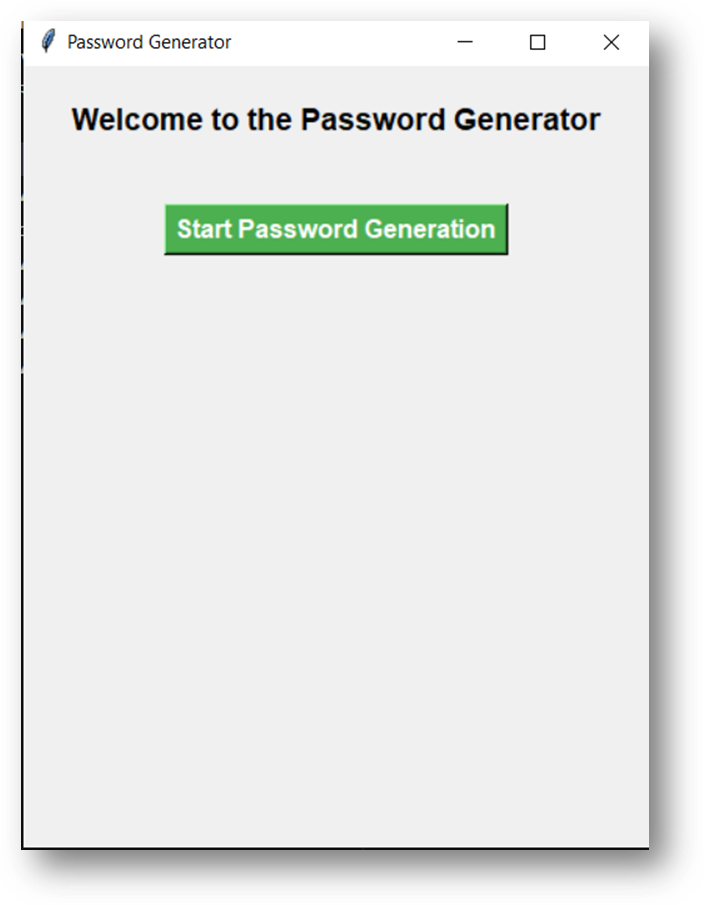
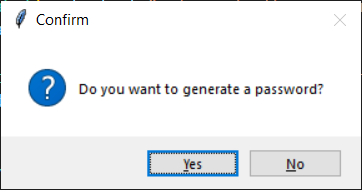
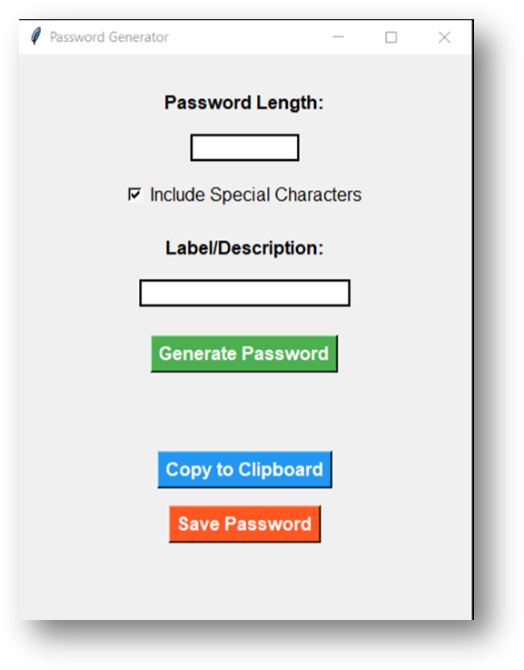
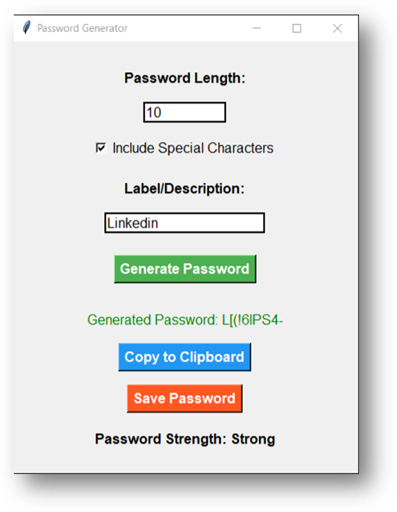
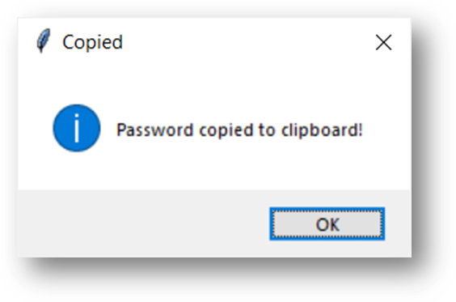
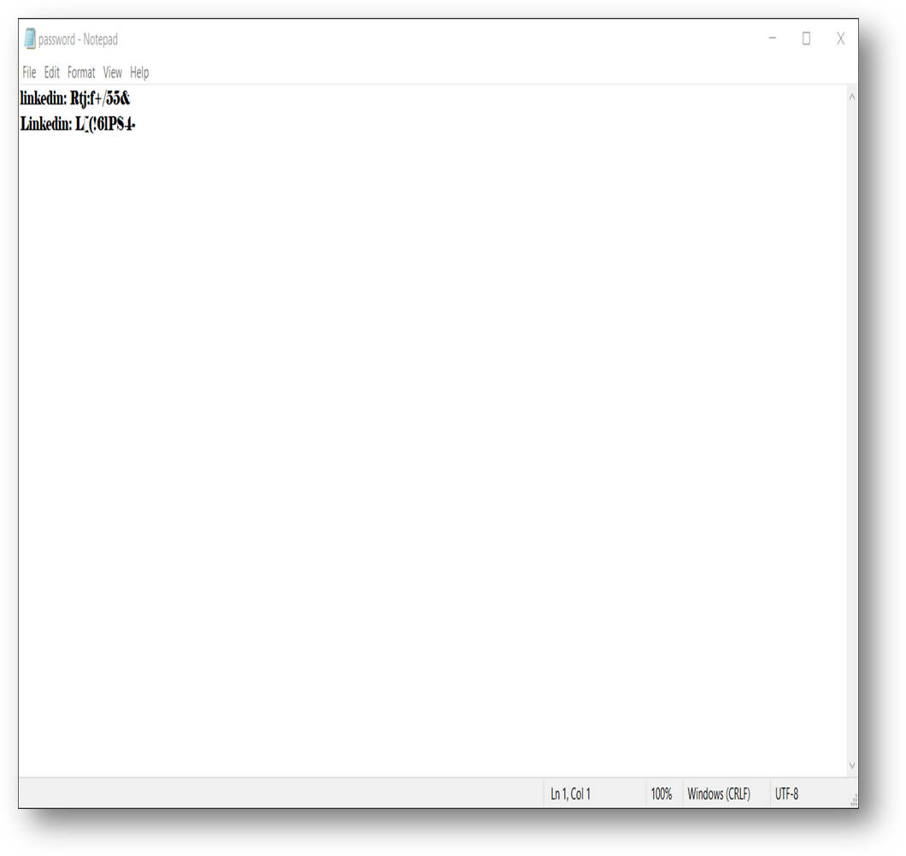

# Password Generator

## Description

The Password Generator is a Python-based desktop application built using Tkinter. It allows users to generate secure passwords with customizable options, including the length of the password and whether to include special characters. The application also evaluates the strength of the generated password and provides options to copy the password to the clipboard or save it to a file with an optional label or description.

## Features

- Generate passwords with customizable length and special characters
- Evaluate and display password strength
- Copy the generated password to the clipboard
- Save the generated password with a label/description to a file

## Requirements

- Python 3.x
- Tkinter (usually included with Python)
- Pyperclip library (install with `pip install pyperclip`)

## Using the Application:

- Start Password Generation: Click the "Start Password Generation" button.
- Enter Password Length: Input the desired length of the password.
- Include Special Characters: Check or uncheck the "Include Special Characters" option.
- Enter Label/Description: Provide an optional label or description for the password.
- Generate Password: Click the "Generate Password" button to create a password.
- Copy to Clipboard: Click the "Copy to Clipboard" button to copy the generated password.
- Save Password: Click the "Save Password" button to save the password with the provided label to a file.

### Screenshots
Here are some screenshots of the output:

### Output 1

### Output 2

### Output 3

### Output 4

### Output 5

### Output 6

### Output 7

