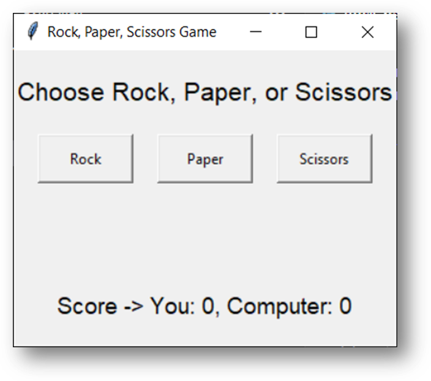
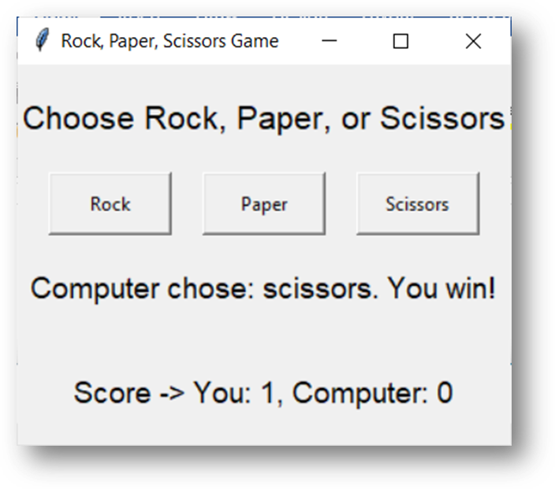
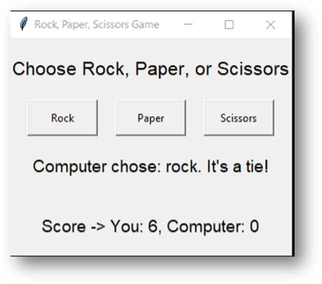
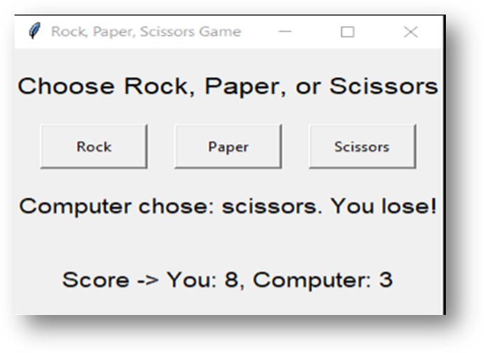

# Rock, Paper, Scissors Game

This is a simple Rock, Paper, Scissors game implemented using Python's `tkinter` library. The game allows the user to play against the computer, keeping track of the score.

## Features

- User can choose between Rock, Paper, or Scissors.
- The computer makes a random choice between Rock, Paper, or Scissors.
- The game determines the winner based on the traditional rules:
  - Rock beats Scissors.
  - Scissors beat Paper.
  - Paper beats Rock.
- The game displays the result of each round and keeps track of the scores.

## Prerequisites

- Python 3.x installed on your system.
- The `tkinter` library, which comes pre-installed with Python.

### Screenshots 

